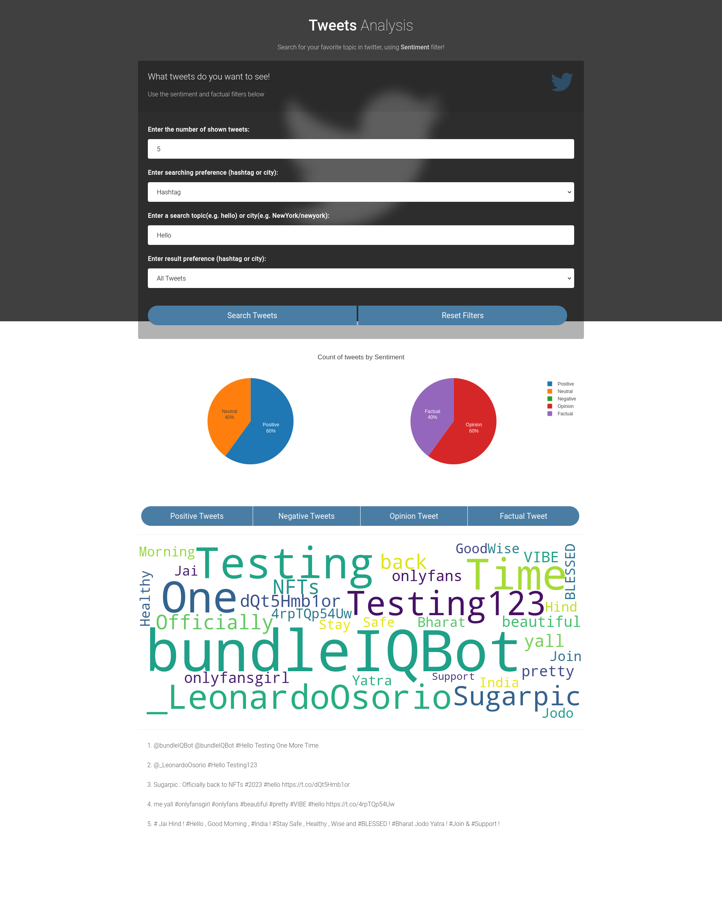

# Scalable infrastructure for twitter sentiment analysis
## A. Import the image into Microk8s registry
### 1. Import images automatically by running `Import_images.sh`
a. change the permission of `.sh` file
```
chmod u+s Import_images.sh
```
b. run `.sh` file
```
Import_images.sh
```
### 2. Import images manually
a. Build celery image
```
sudo docker build ./k8s-celerytwitter-hashtag/. -t celery-hashtag
```
b. Enable microk8s registry
```
sudo microk8s.enable registry
```
c. Save docker image to a tar file
```
sudo docker save celery-hashtag > celery-hashtag.tar
```
d. Import image into k8s registry with the default namespace - k8s.io
```
sudo microk8s ctr -n k8s.io image import celery-hashtag.tar
```
e. Verify the import by listing images. 
```
sudo microk8s ctr -n k8s.io images ls name~=celery
```
f. In the list of images, we could read the size of image, if the size of image is not normal, we could delete the image and reimport.
```
microk8s ctr images rm $(microk8s ctr images ls name~='celery' | awk {'print $1'})
```
g. Remove all the docker images as needed (optional)
```
docker rmi $(docker images -q) -f
```
Now the image on Microk8s is ready to use in the deployment.

## B. 


